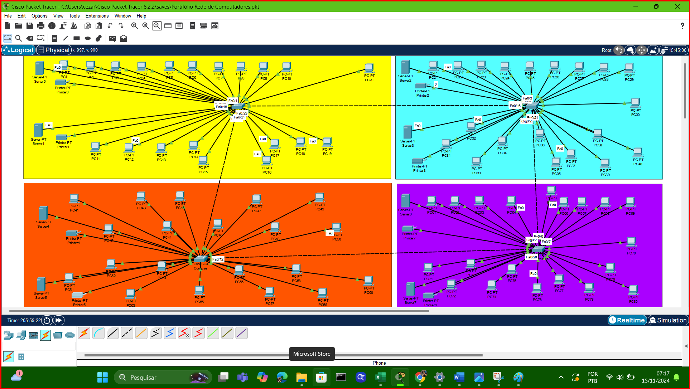
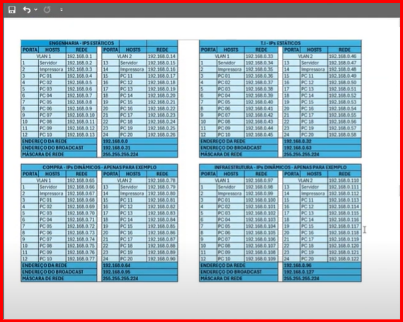

# Design de Rede Corporativa com Cisco Packet Tracer

Este repositório documenta o projeto prático da disciplina de **Redes de Computadores**. O objetivo foi projetar e simular a infraestrutura de rede de uma empresa, segmentando departamentos e garantindo a conectividade entre dispositivos.

## 🎯 Objetivos do Projeto
* Projetar uma topologia de rede funcional para múltiplos departamentos (Engenharia, TI, etc.).
* Realizar o cálculo de **Sub-redes (Subnetting)** para otimização de endereços IP.
* Configurar dispositivos ativos (Switches 2950T) e finais (PCs, Servidores, Impressoras).
* Simular a conectividade em ambiente virtual (**Cisco Packet Tracer**).

## 🛠️ Tecnologias e Conceitos
* **Simulador:** Cisco Packet Tracer.
* **Protocolos:** TCP/IP, Ethernet.
* **Hardware Simulado:** Switches Cisco 2950T.
* **Endereçamento:** IPv4 Classe C.

## 📐 Arquitetura da Solução

O desafio consistiu em estruturar uma rede lógica dividida por departamentos, calculando faixas de IP específicas para evitar conflitos e organizar o tráfego.

### Segmentação de Rede (Subnetting)
Foi utilizada uma rede de **Classe C** subdividida para atender aos requisitos de cada setor. O plano de endereçamento incluiu:
* Definição de Máscaras de Sub-rede.
* Identificação de IPs de Rede e Broadcast.
* Atribuição de IPs válidos para Hosts (Estações de trabalho e Impressoras).

### Topologia Visual
Abaixo, a representação gráfica da rede implementada, demonstrando a conexão física entre os dispositivos e o concentrador (Switch).

### Tabela de Planejamento de IPs
*Detalhe do cálculo de endereçamento realizado para os departamentos:*

> *O relatório técnico completo com todos os cálculos e configurações pode ser consultado na pasta [`/docs`](./docs/).*

## 🏁 Conclusão e Visão de Gestão

Compreender a camada de infraestrutura é um diferencial competitivo para a Gestão de TI. Este projeto demonstra minha competência em:
1.  **Planejamento de Capacidade:** Dimensionar recursos (IPs e Portas) de acordo com a demanda do negócio.
2.  **Visão Sistêmica:** Entender como os dados saem de um servidor e chegam ao usuário final.
3.  **Fundamentos de Nuvem:** O conhecimento de sub-redes e roteamento é a base para gerenciar redes virtuais (VPCs) em ambientes como AWS e Azure.

---

## 🧭 Navegação Completa pelo Portfólio

Confira os meus outros projetos técnicos desenvolvidos durante a graduação em Gestão de TI:

* 🏠 [**Voltar ao Perfil Principal**](https://github.com/cezarscarvalho)
* 💻 [**Lógica de Programação** (Portugol)](https://github.com/cezarscarvalho/logica-programacao-portugol)
* 🐧 [**Sistemas Operacionais** (Linux & VirtualBox)](https://github.com/cezarscarvalho/sistemas-operacionais-linux)
* 📐 [**Lógica e Processos** (Fluxogramas)](https://github.com/cezarscarvalho/logica-fluxograma-processos)
* 🗄️ [**Modelagem de Dados** (MySQL & DER)](https://github.com/cezarscarvalho/modelagem-dados-mysql-biblioteca)

## ✉️ Contato

  
  
  

